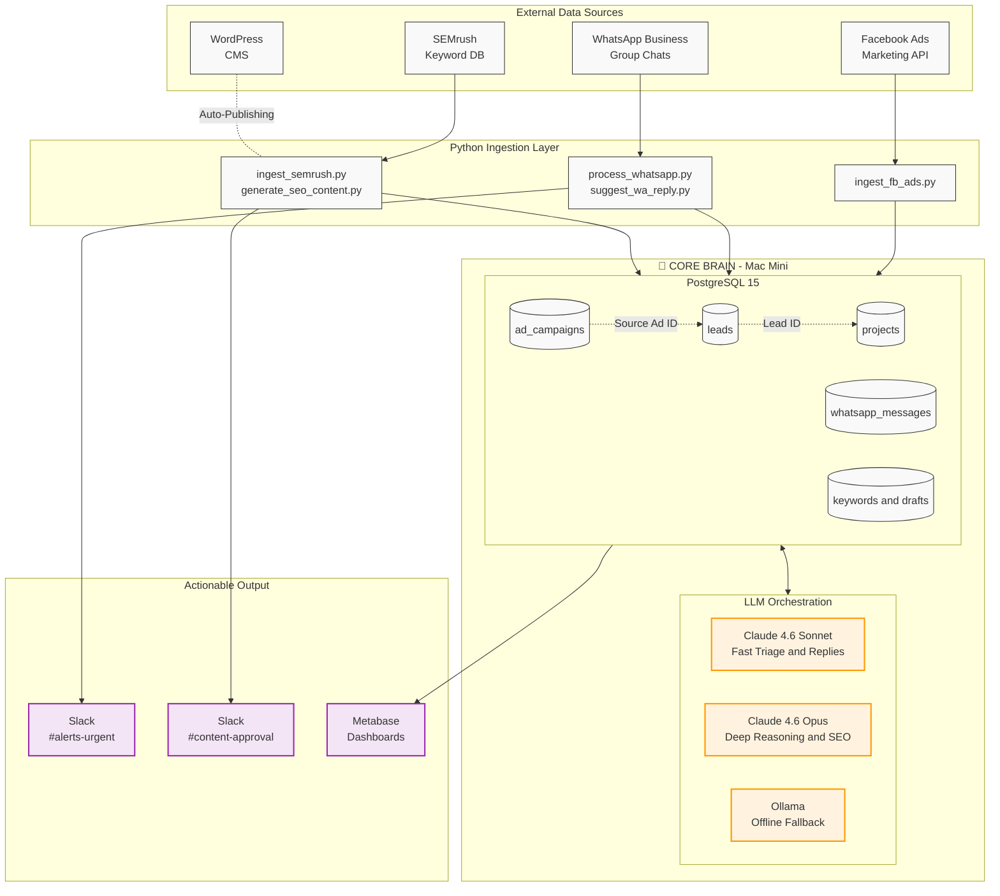

# AI Systems Builder — Architectural Proof of Concept
### *Intelligent Data Unification for a Remodeling Construction Company*

[](https://python.org)
[](https://postgresql.org)
[](https://litellm.ai)
[](https://api.slack.com/block-kit)

---

## 🇺🇸 English Version

### 🎯 Executive Summary
This repository demonstrates a **centralized AI-orchestration architecture** that unifies fragmented data sources — Facebook Ads, WhatsApp Business, WordPress, and SEMrush — into a single PostgreSQL *Core Brain* database hosted on a Mac Mini. 

The system automates the manual workflows of a highly-active residential remodeling company by:
1. Orchestrating a completely hands-off **SEO Keyword-to-Blog pipeline** with rich JSON-LD generation.
2. Monitoring high-volume **WhatsApp group chats** for project emergencies and suggesting AI-drafted replies.
3. Replacing vanity ad metrics with **true revenue attribution** connected to signed contracts.

### 🏛️ System Architecture


### 📐 Data & AI Strategy

#### 1. Hybrid LLM Architecture: The Right Model for the Right Job
This system uses a **tiered LLM strategy** managed via `litellm`:

| Use Case | Model | Rationale |
|---|---|---|
| **WhatsApp Urgency Detection** | `claude-sonnet-4-5` | Low latency (<2s), high throughput for chat classification |
| **WhatsApp Response Drafts** | `claude-sonnet-4-5` | Conversational competence and fast response generation |
| **SEO Blog Generation** | `claude-opus-4-5` | Deep reasoning for strategically targeted construction content |
| **Private / Offline Fallback** | `ollama/llama3` | Runs locally on Mac Mini; zero data egress |

#### 2. Revenue Attribution: Closing the Loop
Relational chain in the Core Brain:
```
ad_campaigns.ad_id  ──→  leads.source_ad_id  ──→  projects.lead_id
     (FB Spend $)          (First Touch)          (Closed Revenue $)
```
A simple SQL JOIN across these tables yields **true ROAS**.

---

## 🇲🇽 Versión en Español

### 🎯 Resumen Ejecutivo
Este repositorio demuestra una **arquitectura de orquestación de IA centralizada** que unifica fuentes de datos fragmentadas — Facebook Ads, WhatsApp Business, WordPress y SEMrush — en una única base de datos PostgreSQL *Core Brain* alojada localmente en una Mac Mini.

El sistema automatiza los flujos manuales de una empresa de remodelaciones residenciales mediante:
1. **Pipeline de SEO**: Keyword-a-Blog totalmente automatizado con esquemas JSON-LD.
2. **Monitoreo de WhatsApp**: Triage de emergencias y sugerencias de respuestas instantáneas.
3. **Atribución Real**: Conexión entre el gasto publicitario y los contratos cerrados (ROAS real).

### 📐 Estrategia de IA y Datos

#### 1. Arquitectura de LLM Híbrida
El sistema optimiza costo y rendimiento mediante niveles:
*   **Claude 4.6 Sonnet**: Tareas de baja latencia (WhatsApp y borradores rápidos).
*   **Claude 4.6 Opus**: Razonamiento profundo (SEO estratégico y técnica JSON-LD).
*   **Ollama (Llama3)**: Procesamiento local privado y fallback offline.

#### 2. Atribución de Ingresos
El sistema vincula el ID del anuncio original con el lead y el proyecto facturado, permitiendo conocer qué campaña generó dinero real y no solo "leads" de formularios.

---

## 🚀 Installation & Setup / Instalación

```bash
# 1. Clone / Clonar
git clone https://github.com/SerjCallier/ai-system-builder-showcase.git
cd ai-system-builder-showcase

# 2. Environment / Entorno
python -m venv .venv
source .venv/bin/activate  # Windows: .venv\Scripts\activate

# 3. Dependencies / Dependencias
pip install -r requirements.txt

# 4. Run / Ejecutar
python main.py
```

---

## 📁 Project Structure / Estructura del Proyecto
```text
AI-Systems-Builder/
├── README.md                 ← You are here
├── requirements.txt          ← Python dependencies
├── config.py                 ← Settings & Webhooks
├── main.py                   ← Simulation entry point
├── core/
│   ├── slack.py              ← Slack Block Kit Templates
│   └── db.py                 ← SQLAlchemy Models
└── scripts/
    ├── ingest_semrush.py        ← Keyword Pipeline
    ├── generate_seo_content.py  ← AI Blog Generator
    ├── suggest_wa_reply.py      ← AI Automated Replies
    ├── ingest_fb_ads.py         ← ROI Evaluator
    └── process_whatsapp.py      ← Chat Monitoring
```
