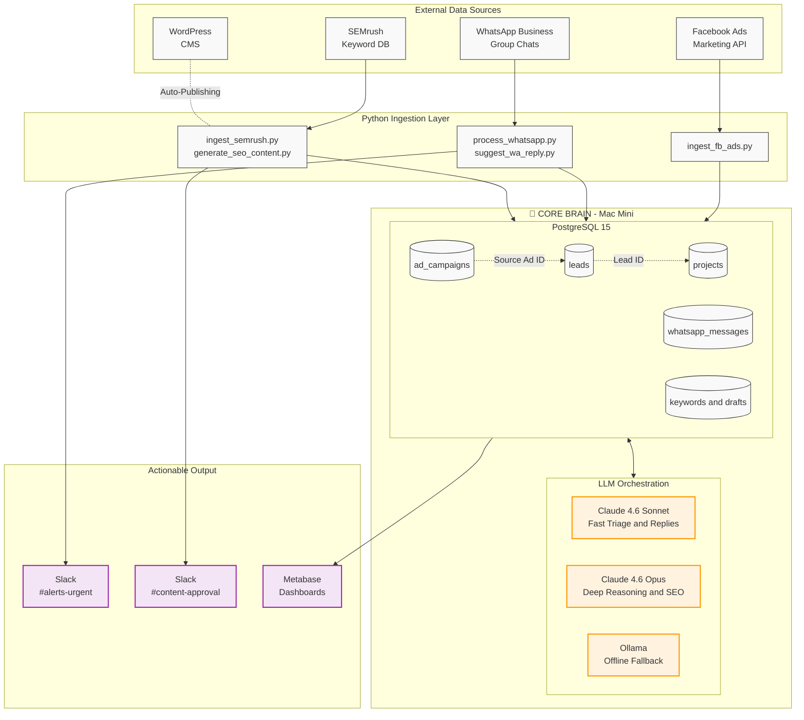

# AI Systems Builder — Architectural Proof of Concept
### *Intelligent Data Unification for a Remodeling Construction Company*

[](https://python.org)
[](https://postgresql.org)
[](https://litellm.ai)
[](https://api.slack.com/block-kit)

---

## 🎯 Executive Summary

This repository demonstrates a **centralized AI-orchestration architecture** that unifies fragmented data sources — Facebook Ads, WhatsApp Business, WordPress, and SEMrush — into a single PostgreSQL *Core Brain* database hosted on a Mac Mini. 

The system automates the manual workflows of a highly-active residential remodeling company by:
1. Orchestrating a completely hands-off **SEO Keyword-to-Blog pipeline** with rich JSON-LD generation.
2. Monitoring high-volume **WhatsApp group chats** for project emergencies and suggesting AI-drafted replies.
3. Replacing vanity ad metrics with **true revenue attribution** connected to signed contracts.

---

## 🏛️ System Architecture



---

## 📐 Data & AI Strategy

### 1. Hybrid LLM Architecture: The Right Model for the Right Job
This system uses a **tiered LLM strategy** managed via `litellm`, which provides a unified API across providers:

| Use Case | Model | Rationale |
|---|---|---|
| **WhatsApp Urgency Detection** | `claude-sonnet-4-5` | Low latency (<2s), high throughput, cost-efficient for high-volume chat classification |
| **WhatsApp Response Drafts** | `claude-sonnet-4-5` | Extremely competent at taking context and immediately returning conversational replies |
| **SEO Blog Generation** | `claude-opus-4-5` | Deep reasoning for long-form, factually accurate, strategically targeted construction content |
| **Private / Offline Fallback** | `ollama/llama3` | Runs locally on Mac Mini; zero data egress; used for sensitive internal project notes |

This hybrid approach **minimizes cost while maximizing quality** where it matters most — fast alerts via Sonnet, premium content via Opus.

### 2. Revenue Attribution: Closing the Loop
The critical business problem is attribution — knowing *which* Facebook campaign generated a *real* signed contract, not just a lead form fill. This is solved through a **relational chain** in the Core Brain:

```
ad_campaigns.ad_id  ──→  leads.source_ad_id  ──→  projects.lead_id
     (FB Spend $)          (First Touch)          (Closed Revenue $)
```

**How it works:**
A simple SQL JOIN across these three tables yields **true ROAS (Return on Ad Spend)** based on actual signed contract value — bypassing vanity metrics entirely.

---

## 🚀 How to Run (Mock Simulation)

> **Note:** All data sources are mocked. No real API keys are required. The system uses an in-memory SQLite database and prints accurate Slack Block Kit payloads to the console to visualize the workflow.

```bash
# 1. Clone the repository
git clone https://github.com/your-org/AI-Systems-Builder.git
cd AI-Systems-Builder

# 2. Create and activate a virtual environment
python -m venv .venv
source .venv/bin/activate  # On Windows: .venv\Scripts\activate

# 3. Install dependencies
pip install -r requirements.txt

# 4. Configure environment variables (mock defaults are provided)
cp .env.example .env

# 5. Run the full end-to-end simulation
python main.py
```

---

## 📁 Project Structure

```text
AI-Systems-Builder/
├── README.md                 ← You are here
├── requirements.txt          ← Python dependencies (pandas, litellm, sqlalchemy)
├── config.py                 ← Environment settings & Slack Webhooks
├── main.py                   ← Simulation entry point (Run this!)
├── .env.example              ← Template for environment variables
├── core/
│   ├── slack.py              ← Slack Block Kit API integration templates
│   └── db.py                 ← SQLAlchemy models: Ads, Leads, WA, Projects, SEO
└── scripts/
    ├── ingest_semrush.py        ← Keyword Pipeline (Volume, Intent, Priority)
    ├── generate_seo_content.py  ← Claude Opus Blog + JSON-LD Generator
    ├── suggest_wa_reply.py      ← AI-drafted automated replies
    ├── ingest_fb_ads.py         ← ROI evaluator and Split-Test Generator
    └── process_whatsapp.py      ← Chat monitoring and AI triage
```

---

## 🔮 Roadmap to Production

- [ ] **Website-to-WhatsApp Chatbot:** Implement FastAPI webhook endpoint for inbound leads, integrating a curated RAG dataset of company knowledge.
- [ ] Connect production Metabase to the PostgreSQL Core Brain for the stakeholder dashboard.
- [ ] Replace mock functions with live API clients (Facebook Marketing API v20, WhatsApp Cloud API).
- [ ] Wire the `core.slack.SlackClient` into interactive Block Kit buttons ("Approve Draft", "Send Reply").
- [ ] Schedule data ingestion jobs via a localized instance of `Airflow` on the Mac Mini.

---
*Built incrementally for scale.*
